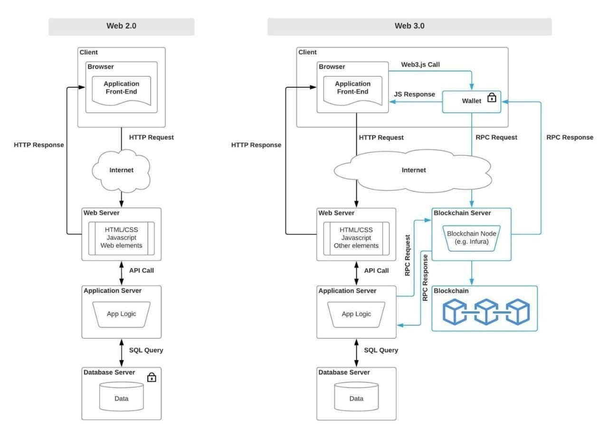

# DAY 5: Workshop use cases and the future

## 👾 The future (~ 30-60 min)
- [3DMs: Data Delivery Markets](https://docs.google.com/presentation/d/1XKHw5oxRUTC6fXnxMJQlnE2HiruZ2cZfw9RpewQV2uY/edit#slide=id.g8b8e94d306_0_2)
- [IPFS Compute](https://github.com/adlrocha/ipfs-compute)
  - [IPFS-FAN](https://research.protocol.ai/publications/ipfs-fan-a-function-addressable-computation-network/)
  - [Slides](https://docs.google.com/presentation/d/1LPHOHLJHFWroFni4Zm1rjGhYMDSUma_g5rRiRdFGLgA/edit#slide=id.gae70f6dc90_0_962)
- [FVM](https://github.com/filecoin-project/fvm-project/)
- [Hierarchical Consensus: Subnets in Filecoin](https://docs.google.com/presentation/d/1MCqqAP7V1wSrbb8uUoZOJ7Qou7t4fjpMlmDHSaJ0ZV4/edit#slide=id.gae70f6dc90_0_962)
- SnapDeals

## 🏗️ Use case: "NFT" Cert platform with TrustOS and IPFS (~120 min)
Build a use case of an NFT platform over IPFS and TrustOS.
- Intro to TrustOS
- Design the architecture of the system.
- Design the infrastructure.
        - Web3.storage // Personal node // Ecosystem tools
- Design the interaction with the IPFS network.
- Design where will the website be hosted (fully decentralized?)

